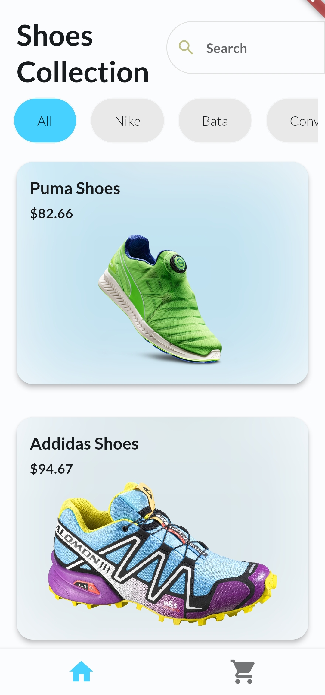
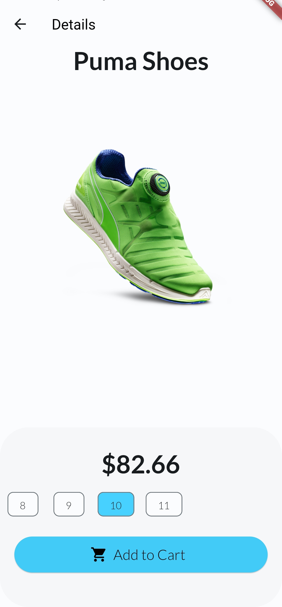
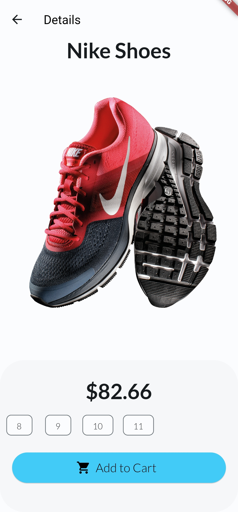
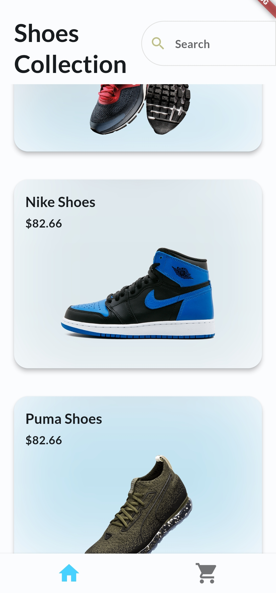
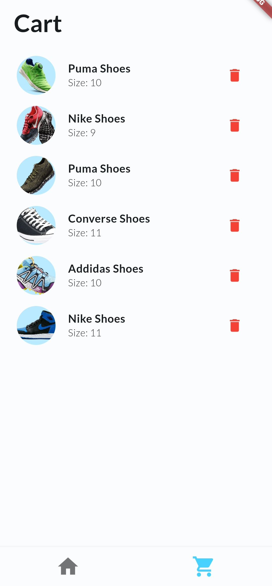
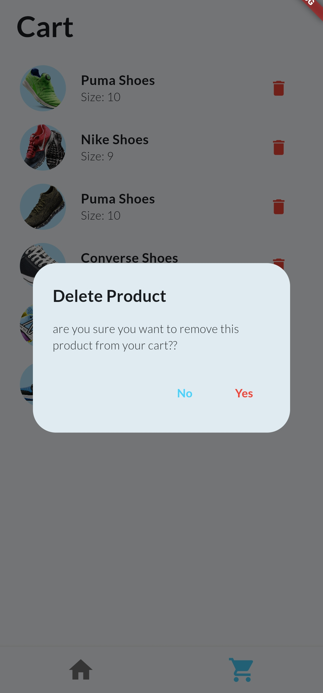

# Shoe Store App UI

This is a simple Flutter application that demonstrates a shoe store app UI where users can browse through a collection of shoes and add them to their cart.

## Features
- View shoe details, including name, price, and description.
- Add items to the shopping cart.
- View and manage items in the shopping cart.
- Beautiful and responsive UI design.

## Screenshots

## Getting Started

This project is a starting point for a Flutter application.

A few resources to get you started if this is your first Flutter project:

- [Lab: Write your first Flutter app](https://docs.flutter.dev/get-started/codelab)
- [Cookbook: Useful Flutter samples](https://docs.flutter.dev/cookbook)

For help getting started with Flutter development, view the
[online documentation](https://docs.flutter.dev/), which offers tutorials,
samples, guidance on mobile development, and a full API reference.

## Contact

If you have any questions or suggestions regarding the app or this repository, please feel free to contact us:

Kishan Vyas
Email: kishanvyas308@gmail.com
GitHub: [Your GitHub Profile](https://github.com/Kishan-Vyas)https://github.com/Kishan-Vyas
